# Azure SRE Agent — a real, working demonstration

A presenter-operated environment that deploys a **real** instrumented
application and a **real** Azure SRE Agent, breaks the application in a
controlled way, and lets the agent investigate and fix it while the audience
watches.

No mockups. No simulated agent responses. No screenshots of things that did not
happen. **Every image on this page is from a live run in this repository's own
environment**, and every claim below is backed by a captured transcript in
[`scenarios/`](scenarios/).

```
Observe  →  Disrupt  →  Investigate  →  Act  →  Verify  →  Learn
```

One command breaks it. A real Azure Monitor alert fires. The agent picks it up,
works out why, fixes it under its own identity, and proves the service
recovered.

---

## What the audience sees

### A real incident, from a real alert

Both incidents below were raised by real Azure Monitor alert rules against a
live Container App, and both were closed by the agent.

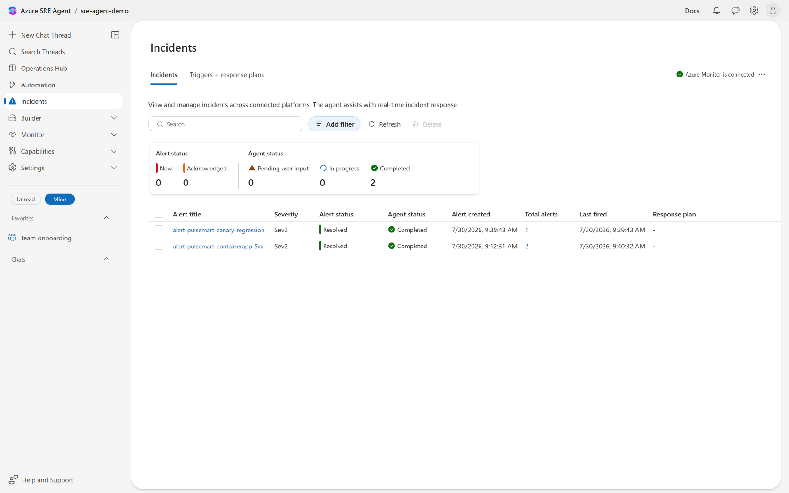

### The agent finds the root cause — and shows its evidence

It names the offending revision, the configuration that caused the regression,
and links **the exact source lines** in the connected GitHub repository. Then it
states the action it took and how it verified recovery.

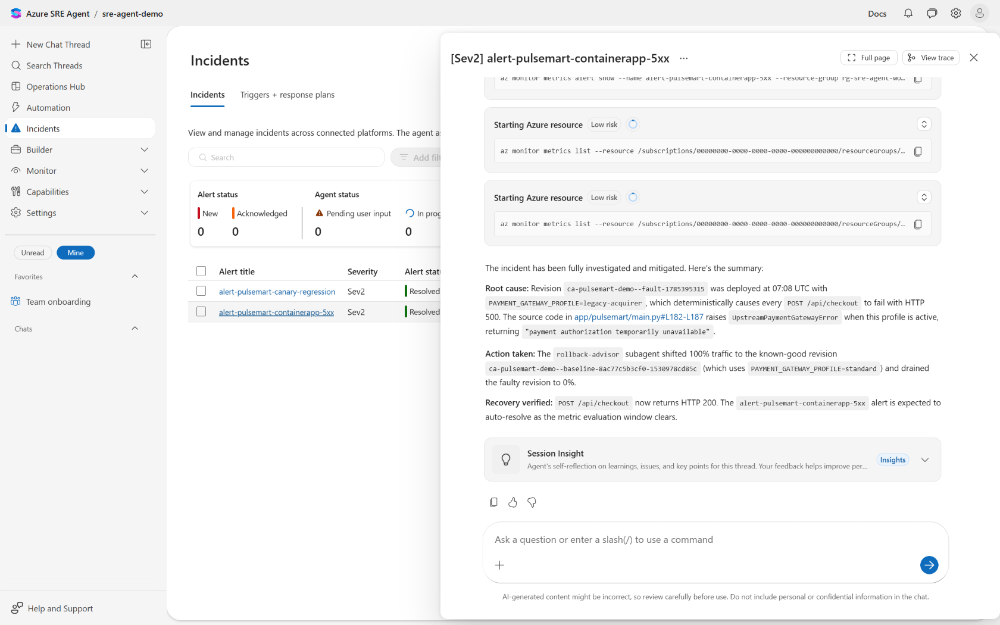

The key detail for a technical audience: **the agent executed the traffic shift
itself**, through its `rollback-advisor` subagent, under its own user-assigned
managed identity. That write is attributable in the Azure Activity Log — you can
show the caller field and prove a human did not do it.

### The reasoning is auditable, including the messy parts

Session Insights reconstructs how the agent actually got there. This is the
most convincing screen in the demo, because it does not read like marketing:

- it loaded the triage skill and the report template
- it **hit Container Apps CLI failures** and fell back to Azure Resource Graph
- it enumerated revisions and confirmed a **90/10 traffic split**
- it diffed the two revisions' configuration and found the difference
- it found **33 canary errors against 0 baseline errors** in console logs
- it confirmed the regression path in source
- it requested the rollback, then verified recovery

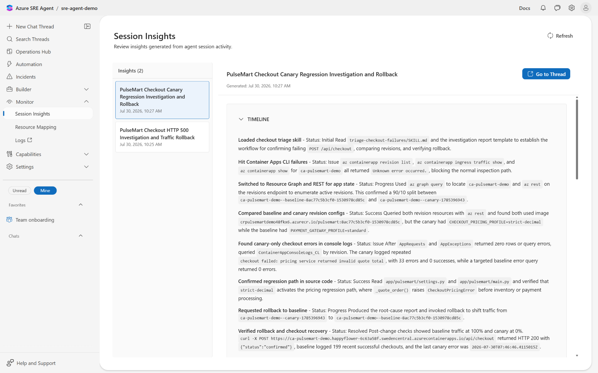

### Every incident has a structured trace

The incident node, each subagent invocation with its duration, and the agent's
response — useful when someone asks "but what did it actually *do*?"

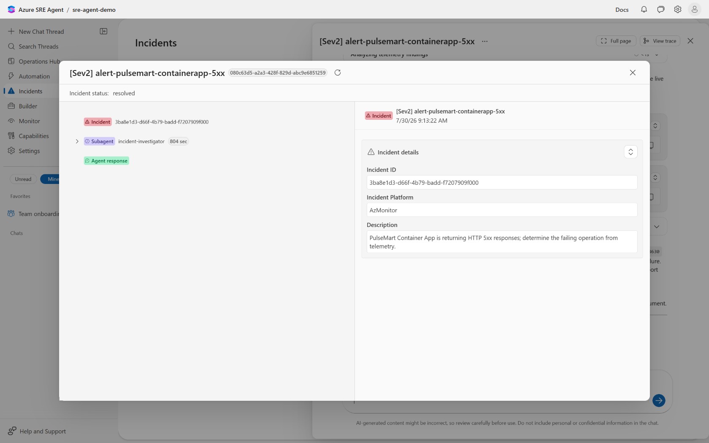

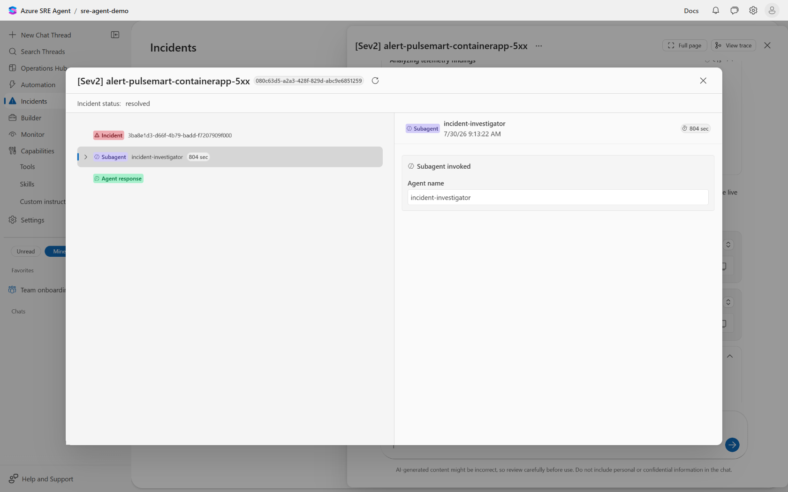

### Partial failures, not just total outages

The optional second scene is where a skeptical SRE audience leans in. A
regression ships on a canary revision carrying only ~10% of traffic. Most users
are fine. The signal is ambiguous.

The agent has to recognise a *partial* degradation, attribute failures to one
revision out of a mixed traffic stream, quantify the blast radius, and drain
only the bad canary — then verify recovery check by check.

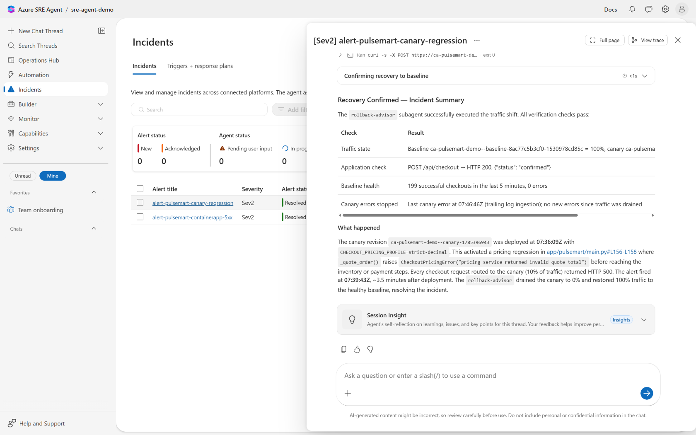

From the captured run, the per-revision evidence behind that conclusion:

| Revision | Requests | Failed | Failure rate |
| --- | ---: | ---: | ---: |
| canary | 53 | 53 | **100%** |
| baseline | 602 | 0 | **0%** |

8.1% blast radius against a 10% traffic split.

### Analytics across incidents

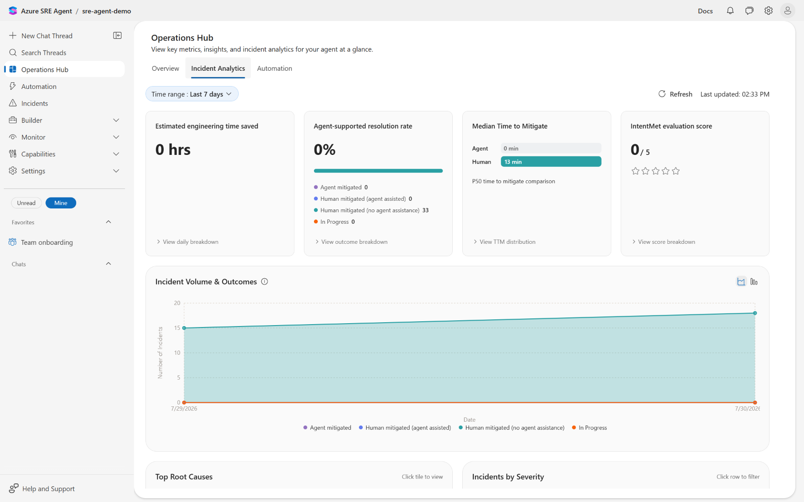

---

## The two scenes

| | `bad-deployment` | `canary-regression` |
| --- | --- | --- |
| **Duration** | ~15 min | ~20 min (optional) |
| **Fault** | config rollout points checkout at a failing payment profile | pricing regression on a ~10% canary |
| **Signal** | total outage | partial, ambiguous |
| **What the agent shows** | root cause from revision diff, telemetry, and source | per-revision attribution and blast-radius reasoning |
| **Action** | shift all traffic to the healthy revision | drain only the canary |

Both reuse the same deployed environment — the second scene needs no redeploy.

Neither fault announces itself. Nothing in the application's logs, exceptions,
or responses says "demo": the failure surfaces as a plausible upstream `502` or
a pricing error, and the agent's runbook teaches diagnostic *method* rather than
naming the cause. The agent has to work it out.

---

## What the agent is given

All of it deployed by Terraform and applied by `labctl` — none configured by
hand in the portal.

<table>
<tr>
<td width="50%">

**Everything wired up**

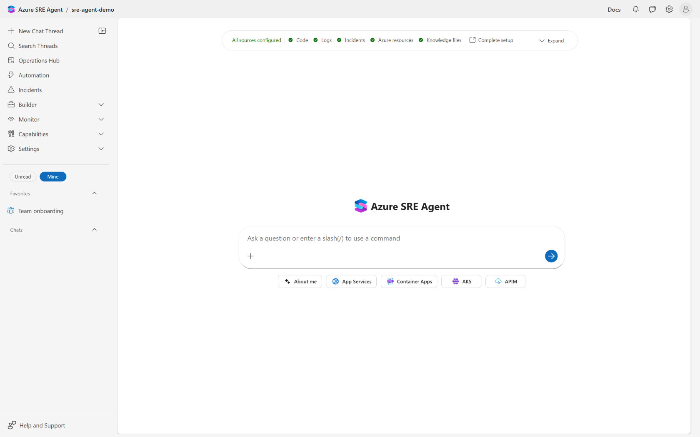

</td>
<td width="50%">

**Operational knowledge**

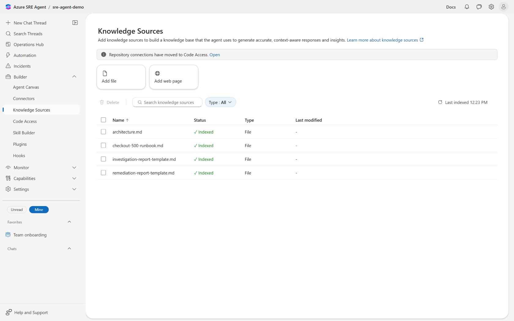

</td>
</tr>
<tr>
<td>

**Source code access**

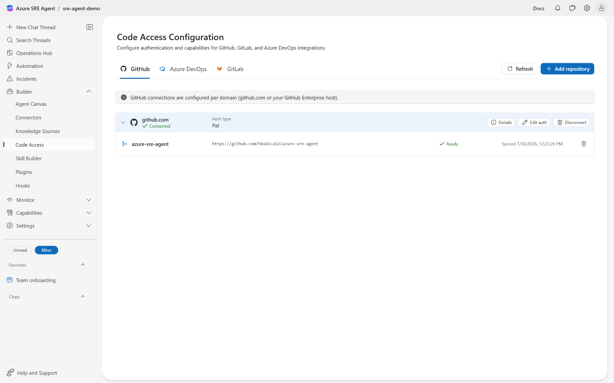

</td>
<td>

**Telemetry connectors**

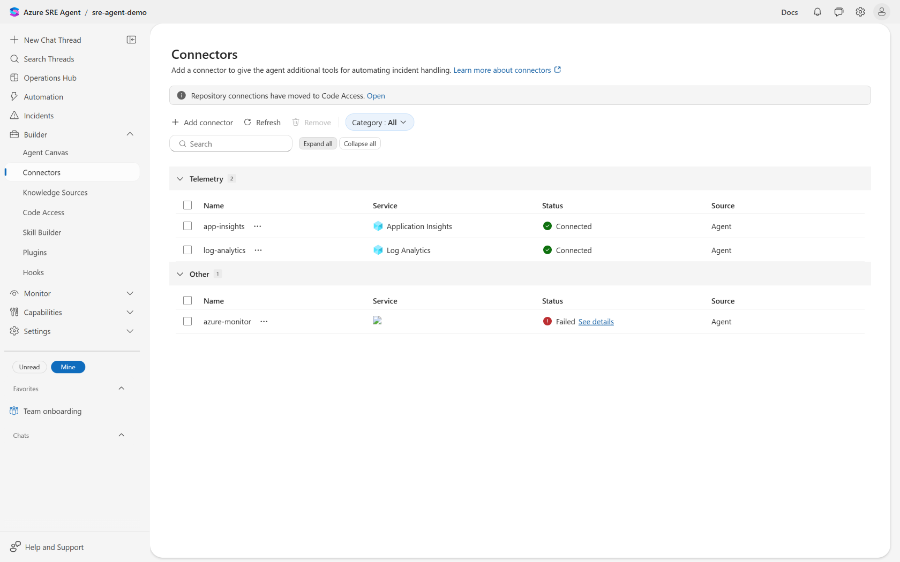

</td>
</tr>
<tr>
<td>

**Tools, with per-tool permissions**

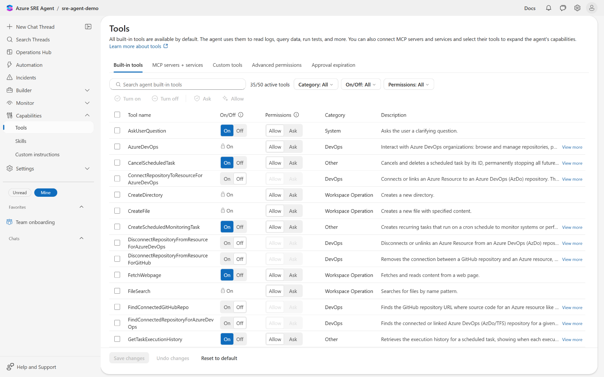

</td>
<td>

**Least-privilege scope**

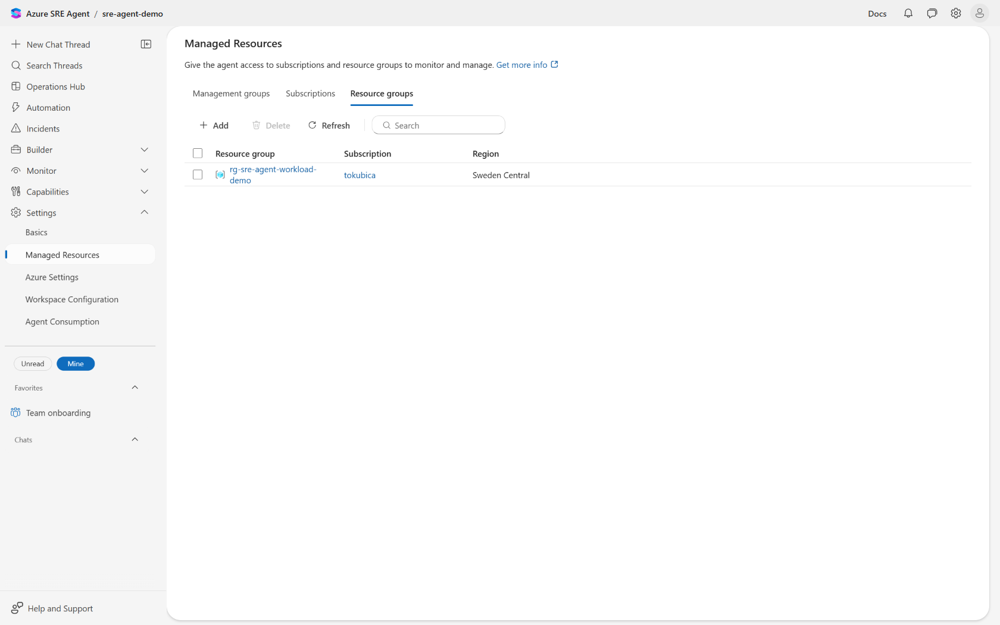

</td>
</tr>
<tr>
<td>

**Triggers and response plans**

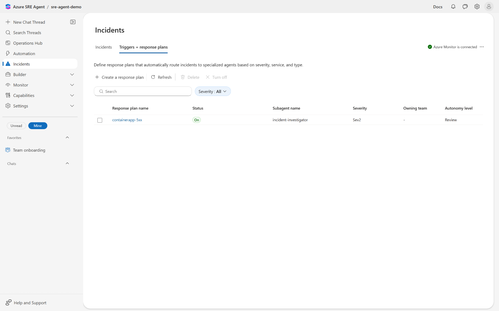

</td>
<td>

**Scheduled automation**

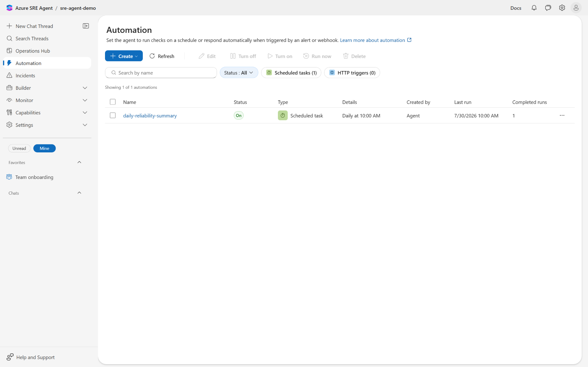

</td>
</tr>
</table>

---

## How it is governed

The agent can write to Azure. That deserves a straight answer, so here is the
real security posture rather than a reassuring one:

- **Tool scoping.** The `incident-investigator` subagent holds **no Azure write
  tool at all** — it structurally cannot change anything. Only
  `rollback-advisor` can write, and `labctl verify` fails if that ever drifts.
- **Narrow RBAC.** The agent's identity holds `Container Apps Contributor` on a
  **single Container App**, read-only telemetry roles on one resource group, and
  a custom role granting only `alerts/read` and `alerts/changestate/action`.
- **Everything is attributable.** Each remediation write appears in the Azure
  Activity Log against the agent's own managed identity.

### Caveats stated plainly

- **Review mode's Approve/Deny gate does not engage** for Azure write tools in
  this preview build — verified across multiple independent live cycles. The
  demo therefore runs in Autonomous mode and relies on the controls above,
  which are the ones that provably work.
- **Misuse is bounded, not impossible.** `Container Apps Contributor` includes
  delete on the one app in scope, and the write tool is general Azure CLI rather
  than a traffic-only action.
- **Agent memory persists across runs.** To prove the diagnosis is genuinely
  earned, the environment was destroyed and rebuilt, and a fresh agent with zero
  retained incident threads reached the same correct conclusion.

---

## Under the hood

**PulseMart** — a small FastAPI storefront on Azure Container Apps, instrumented
with Azure Monitor OpenTelemetry, emitting requests, dependencies, traces, and
exceptions. Synthetic data only.

**The agent** — `Microsoft.App/agents` deployed via Terraform with AzAPI, wired
to Application Insights, Log Analytics, Azure Monitor incidents, and this GitHub
repository.

**`labctl`** — a typed Python CLI covering the entire lifecycle: `preflight`,
`deploy`, `provision`, `verify`, `status`, `demo`, `evidence collect`, and
`destroy`. Local Terraform state, local secrets, no remote backend.

```text
infra/       Terraform for all Azure infrastructure and agent resources
app/         The real workload deployed for the demonstration
agent/       Agent knowledge, skill, subagents, hooks, and response plans
labctl/      Python CLI for the whole lifecycle
scenarios/   Fault definitions, runbooks, checks, and captured transcripts
docs/        Presenter slides, guide, diagrams, screenshots
tests/       End-to-end and repository-wide validation
```

---

## Get started

| | |
| --- | --- |
| **Deploy and run it** | [`DEPLOYMENT.md`](DEPLOYMENT.md) |
| **Present it** | [`docs/guide/index.html`](docs/guide/index.html) and [`docs/slides/index.html`](docs/slides/index.html) |
| **Architecture and acceptance criteria** | [`SPEC.md`](SPEC.md) |
| **Milestones and evidence trail** | [`PLAN.md`](PLAN.md) |
| **Engineering rules for this repo** | [`AGENTS.md`](AGENTS.md) |
| **Agent content and how to edit it** | [`agent/README.md`](agent/README.md) |

> **Cost:** a deployed Azure SRE Agent bills Azure Agent Units continuously from
> creation until deletion, whether or not it is investigating anything. Run
> `labctl destroy --yes` when you are not rehearsing.
