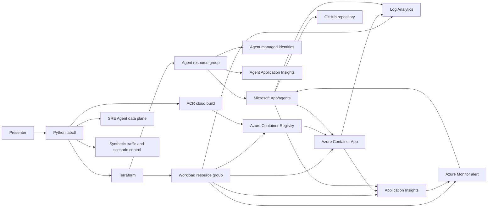

# Azure SRE Agent demonstration specification

**Status:** Approved implementation baseline  
**Research date:** 2026-07-28  
**Primary region:** Sweden Central  
**Primary operator platform:** Windows PowerShell

## 1. Outcome

Build a presenter-operated environment that deploys a real instrumented
application and a real Azure SRE Agent, creates a controlled production-like
incident, lets the agent investigate it with Azure and source-code context,
executes the real remediation itself under its own identity (Autonomous mode,
governed by tool scoping rather than a platform approval click -- see section
5 Scene 5 for why), and proves recovery.

One Python CLI, `labctl`, owns the complete lifecycle:

```text
preflight -> deploy -> provision -> verify -> trigger -> investigate
-> agent executes rollback -> verify recovery -> reset -> collect evidence
-> destroy
```

The repository must be usable repeatedly without hidden portal setup beyond an
explicitly detected OAuth or consent boundary.

## 2. Audience

The primary audience is architects, platform engineers, SREs, and technical
decision makers evaluating Azure SRE Agent.

This is not a student hands-on lab. The presenter runs the automation and uses
the HTML material as the delivery surface.

## 3. Product baseline

The implementation is based on first-party documentation and the official
`microsoft/sre-agent` infrastructure-as-code templates current on 2026-07-28.

Verified product facts:

- Azure SRE Agent is deployed as `Microsoft.App/agents`.
- The active subscription exposes API versions `2026-01-01` and
  `2025-05-01-preview`.
- Microsoft currently documents Bicep, Terraform, PowerShell, and Azure
  Developer CLI deployment backends.
- The official Terraform implementation uses AzureRM for stable resources and
  AzAPI for the agent and connectors.
- Agent configuration is two-phase:
  - ARM deploys infrastructure, identity, RBAC, the agent, and connectors.
  - The agent data plane applies knowledge, hooks, skills, subagents,
    scheduled tasks, response plans, and source repositories.
- The agent data-plane token audience is `https://azuresre.dev`.
- Sweden Central is supported in the active subscription and exposes both
  Microsoft Foundry and Anthropic models.
- Azure SRE Agent charges always-on and active-flow Azure Agent Units. Deleting
  the agent is the only way to stop all agent billing.

The initial implementation uses `Microsoft.App/agents@2025-05-01-preview`
because this is the current default API in the provider and the version used by
Microsoft's official Terraform template. Migration to `2026-01-01` is a
separate validation item because its Entra Agent ID sponsor-group contract is
not yet represented in the official customer Terraform path.

## 4. Non-goals

- Student accounts, exercises, grading, or multi-user lab orchestration.
- Production landing-zone design.
- Multi-region application deployment.
- Third-party incident platforms such as PagerDuty or ServiceNow.
- Private networking in the first implementation.
- A general framework for arbitrary demo applications.
- Mock agent responses or prerecorded results presented as live behavior.

## 5. Demonstration narrative

### Scene 1: Healthy service

Show the PulseMart order API and status dashboard serving successful checkout
requests. Show:

- the current release and active Container Apps revision;
- request success, latency, dependency calls, traces, and logs;
- the monitored resource group;
- the Azure SRE Agent portal, scope, model, mode, and configured context.

### Scene 2: Grounded exploration

Ask the agent to:

- map the application architecture;
- summarize health over the last 30 minutes;
- identify the active revision and recent configuration changes;
- cite Azure Monitor, Application Insights, Log Analytics, and source files.

This proves read-only investigation before any incident.

### Scene 3: Bad deployment

`labctl demo trigger bad-deployment` creates a new Container Apps revision from
the same immutable image with a controlled
`PAYMENT_GATEWAY_PROFILE=legacy-acquirer` configuration and shifts production
traffic to it.

The Container App runs in Multiple revision mode. The known-good and failing
revisions remain available concurrently, and scenario control changes explicit
traffic weights rather than replacing the application resource.

The fault:

- returns HTTP 500 for checkout requests with response body
  `payment authorization temporarily unavailable`;
- logs `checkout failed: upstream payment gateway returned HTTP 502 Bad Gateway
  while authorizing the charge`;
- emits structured errors, exceptions, trace attributes, release metadata, and
  revision metadata;
- leaves health and administrative endpoints available;
- stores no customer or persistent data;
- is reversible by shifting traffic back to the known-good revision.

`labctl` drives enough synthetic checkout traffic to cross the real alert
threshold. The alert rule is `alert-pulsemart-containerapp-5xx`, and the
response plan is `containerapp-5xx`.

### Scene 4: Automated incident investigation

An Azure Monitor alert enters Fired state. The Azure Monitor incident platform
and response plan route it to a custom incident investigator.

The agent must:

- identify the failed operation and affected revision;
- query Application Insights and Log Analytics;
- correlate the failure with the revision and environment change;
- inspect the connected GitHub repository and identify the fault behavior;
- apply the uploaded incident runbook;
- produce a root-cause hypothesis with cited evidence;
- propose shifting traffic to the healthy revision.

### Scene 5: Autonomous-mode remediation, tool-scoped

The agent runs with High access. The agent-wide `actionConfiguration.mode`
stays at its documented default of `Review`, but the `containerapp-5xx`
incident response plan is configured `agentMode: Autonomous`
(`agent/automations/incident-filters/checkout-5xx.yaml`, metadata name
`containerapp-5xx`) -- a product-owner
decision, 2026-07-30, made because **live-tested 2026-07-29, three
independent cycles** (see PLAN.md Milestone 5 for the full evidence trail,
including a run on a freshly created incident thread whose own `agentMode`
field read `"Review"`, and a second run after removing the agent's UAMI's
"SRE Agent Administrator" role to rule out self-approval) showed that in
this API version, neither the agent-level/response-plan Review mode's own
approval prompt nor a `PreToolUse` (nor a `Stop`-event, `onDemand`) hook
reliably pauses execution before a mutating `az containerapp ingress
traffic set` runs -- `GET /api/v1/approvals/{threadId}` stayed empty
throughout, and the write landed in the Azure Activity Log seconds after
the tool call, with no human action. This is treated as a confirmed,
currently-unfixable (from this repository's side) platform limitation of
the preview data-plane API, not a configuration defect in this repository.
Configuring `Review` on the response plan while a write-capable subagent
executes unattended would describe intent, not observed behavior; this
repository chooses to be honest about which mode is actually in effect
instead.

**The agent itself executes the real rollback.** `rollback-advisor` (the
subagent the `containerapp-5xx` response plan hands remediation to) states the
exact `az containerapp ingress traffic set` command it is about to run, then
runs it for real under its own managed identity, then verifies and reports
recovery. The presenter's role in this beat is to narrate the agent's stated
intent and executed action, and to independently confirm -- via the Azure
Activity Log's `caller` field, never via the agent's own self-reported
narrative alone -- that the write was made by the agent's own identity.

The real, verified safety gate is **tool-scoping**, not a Review-mode click:

- `incident-investigator` (the subagent that receives the routed incident)
  holds no `RunAzCliWriteCommands` tool at all and is structurally
  incapable of mutating anything -- it can only investigate and hand off.
- `rollback-advisor` is the only subagent in `agent/` that holds
  `RunAzCliWriteCommands`. Its managed identity has one workload write grant:
  "Container Apps Contributor" scoped to just the `ca-pulsemart-demo`
  Container App resource, not Contributor over the resource group
  (`infra/modules/sre_agent`'s `workload_access_level = "narrow"`). The same
  UAMI also has a subscription-scoped custom alert-lifecycle role with only
  `Microsoft.AlertsManagement/alerts/read` and
  `Microsoft.AlertsManagement/alerts/changestate/action`. A write attempted
  against any other resource in `rg-sre-agent-workload-demo` -- the Log
  Analytics workspace, the container registry, the alert rule, or anything
  else -- fails with `AuthorizationFailed` at the ARM level regardless of what
  the model decides to try. See PLAN.md Milestone 5 for a live-captured example
  of this constraint actually firing.

The `require-approval-for-changes` and `deny-destructive-deletes` pre-tool
hooks remain configured as documented intent (and so they would engage
automatically if Microsoft's platform later fixes the underlying
persistence/enforcement defect), but must not be presented as, or relied on
as, the operative safety gate today -- tool-scoping and the narrow RBAC
scope are.

`labctl demo reset <scenario>` remains the operator's reliable safety net
for returning the environment to a known baseline (for example if the
agent's rollback attempt does not complete, or before ending a session), but
it is **not** this scenario's Act-beat mitigation step -- the agent already
performed the real mitigation.

### Scene 6: Recovery proof

`labctl demo verify bad-deployment` confirms:

- the application user journey succeeds;
- production traffic targets the known-good revision;
- `labctl` sends three times the telemetry floor as fresh checkout requests,
  polls Application Insights for bounded ingestion, and reports recovery as
  proved only when the fresh, `itemCount`-weighted Application Insights total is
  at least 12 post-rollback checkout requests with zero `itemCount`-weighted
  HTTP 5xx responses. That is stricter than the Container App metric alert's
  firing condition of at least three HTTP 5xx responses in the evaluation
  window. If successful live checkouts are visible but ingestion has not reached
  12 weighted requests before the timeout, the telemetry proof is reported as
  pending rather than as a service regression;
- the alert is either resolved or explicitly reported as a non-fatal pending
  Azure Monitor resolution after service recovery is proved.

### Scene 7: Canary regression

`labctl demo trigger canary-regression` creates a new Container Apps revision
from the same immutable image with
`CHECKOUT_PRICING_PROFILE=strict-decimal` and sends about 10% of production
traffic to it while the stable revision continues serving the other traffic.

The fault:

- fails checkout pricing only on the canary revision;
- leaves the stable revision healthy;
- produces mixed checkout success and failure signals instead of a total outage;
- is reversible by draining only the canary revision back to 0% traffic.

The dedicated Application Insights scheduled-query alert
`alert-pulsemart-canary-regression` evaluates checkout requests and fires when
`total >= 30`, `failed >= 3`, and `failed / total >= 0.05` within the alert
window.

The agent must:

- recognize a partial degradation rather than a full checkout outage;
- attribute failures to the canary revision using telemetry dimensions and
  Container Apps revision state;
- quantify blast radius from the traffic split and observed request outcomes;
- recommend or execute a targeted drain of only the canary while preserving the
  stable revision.

`labctl demo verify canary-regression` confirms:

- while the fault is active, mixed checkout success and failure are observed and
  a non-baseline revision is receiving traffic;
- after recovery, production traffic is 100% on the known-good revision;
- `labctl` sends three times the telemetry floor as fresh checkout requests,
  polls Application Insights for bounded ingestion, and reports recovery as
  proved only when the fresh, `itemCount`-weighted Application Insights total is
  at least 30 post-drain checkout requests with zero `itemCount`-weighted HTTP
  5xx responses. That is stricter than the alert's `total >= 30`, `failed >= 3`,
  and `failed / total >= 0.05` firing predicate, which is also expressed with
  `itemCount`-weighted counts. If successful live checkouts are visible but
  ingestion has not reached 30 weighted requests before the timeout, the
  telemetry proof is reported as pending rather than as a service regression;
- a still-Fired Azure Monitor alert is reported as a warning because live
  auto-resolution can lag service recovery.

### Scene 8: Broader feature tour

Reuse the environment to show:

- a scheduled daily reliability summary;
- custom skills and subagents;
- safety hooks and audit telemetry;
- source-code context;
- memory and knowledge from the incident;
- incident response plans and run modes;
- available connectors and MCP extensibility;
- agent consumption and cost controls.

Features that require elapsed time, prior memory indexing, or external consent
must be labeled as such in the presenter guide.

## 6. Architecture



### Azure resources

| Scope | Resource | Purpose |
| --- | --- | --- |
| Workload RG | Azure Container Registry Basic | Cloud-build and store the immutable demo image |
| Workload RG | Log Analytics workspace | Container Apps platform and console logs |
| Workload RG | Application Insights | OpenTelemetry requests, traces, dependencies, and exceptions |
| Workload RG | Container Apps environment | Serverless workload runtime |
| Workload RG | Container App | PulseMart service and revision-based rollback |
| Workload RG | User-assigned identity | ACR pull without registry credentials |
| Workload RG | Metric or scheduled-query alert | Real checkout failure incident |
| Workload RG | Action group | Optional human-facing alert notification target |
| Agent RG | User-assigned identity | Agent knowledge and action identity |
| Agent RG | Log Analytics workspace | Agent platform telemetry |
| Agent RG | Application Insights | Agent audit and operational telemetry |
| Agent RG | `Microsoft.App/agents` | Azure SRE Agent |
| Agent child | App Insights connector | Direct workload telemetry context |
| Agent child | Log Analytics connector | Direct workload log context |
| Agent child | Azure Monitor connector | Alert ingestion |

Two resource groups make ownership, permissions, cost inspection, and cleanup
clear while keeping one local Terraform state.

## 7. Workload

PulseMart is a small Python FastAPI application that serves:

- an HTML status and checkout interface;
- `GET /healthz`;
- `GET /api/status`;
- `POST /api/checkout`;
- structured JSON logs.

OpenTelemetry instrumentation sends:

- server requests;
- custom checkout spans;
- exception events;
- release and revision attributes;
- dependency calls;
- custom failure-mode dimensions.

The image is built by `az acr build`; a local Docker daemon is not required.
The image tag is derived from the Git commit plus a content hash so deployments
are reproducible and inspectable.

The workload disables Azure Monitor OpenTelemetry sampling for checkout traces
(`OTEL_TRACES_SAMPLER=microsoft.fixed_percentage`,
`OTEL_TRACES_SAMPLER_ARG=1.0`, and `sampling_ratio=1.0` in the distro setup).
This low-traffic demo prefers complete request evidence over ingestion savings.
Verification and alert queries still use Application Insights `itemCount` so
their request totals and failure counts remain sampling-aware if sampling is
ever reintroduced.

The application does not expose a public fault-toggle endpoint. Scenario state
changes only through authenticated Azure control-plane operations performed by
`labctl`.

The Container App uses Multiple revision mode. Terraform creates its stable
shell but ignores subsequent template and traffic-weight changes. `labctl`
creates immutable revisions, records the known-good revision, and owns all
traffic changes. This prevents Terraform from reverting an agent-executed
rollback during a demonstration.

## 8. Terraform design

The root module under `infra/environments/demo` owns all Azure resources.
Reusable resource groups are implemented under `infra/modules`.

Providers:

- `hashicorp/azurerm` for supported Azure resources;
- `azure/azapi` for Azure SRE Agent and its connectors;
- no Microsoft Graph provider initially.

Microsoft Graph is intentionally omitted because the currently supported
official third-party deployment path does not require a customer-created Graph
object. If live validation of API `2026-01-01` proves that
`agentIdentity.initialSponsorGroupId` is required and available to this tenant,
the sponsor security group will be added through the Microsoft Graph provider
in a focused migration.

### Deployment sequence

1. Terraform applies a bootstrap state using a public bootstrap image.
2. `labctl deploy` PATCHes the agent's `properties.incidentManagementConfiguration`
   directly via `az rest` (real HTTP PATCH), idempotently, immediately after
   `terraform apply` succeeds -- not through a Terraform resource. Live
   testing showed the AzAPI provider's `azapi_resource` PUT semantics reset
   this field on any unrelated apply, and its documented partial-update
   resource (`azapi_update_resource`) fails live with ARM error
   `MismatchingResourceIdentityPrincipalId` (see
   `docs/adr/0001-incident-platform-reconciliation.md`). This makes a repeat
   `labctl deploy` genuinely safe: the field is reconciled on every run.
3. `labctl` runs an ACR cloud build for the actual application image.
4. `labctl` updates the Container App to the immutable ACR image and records the
   resulting known-good revision.
5. `labctl provision` applies agent data-plane configuration (it only reads
   the incident platform back to confirm step 2 already configured it; it
   never PATCHes it itself).
6. `labctl verify` checks Azure, application, telemetry, alerting, and agent
   configuration.

Terraform uses a lifecycle ignore rule for the Container App template and
traffic weights because the demonstration intentionally changes both through
the Azure control plane. This keeps one state file, avoids Terraform targets
and local Docker, and prevents desired-state reconciliation from fighting the
incident workflow. `labctl reset` restores the recorded baseline before an
infrastructure upgrade or destroy.

### State and configuration

- Terraform state is local under an ignored `.state/` path.
- Non-secret operator settings live in `config.local.toml`, generated from an
  example and ignored.
- A configured `azure.subscription_id`/`tenant_id` (see `config.local.toml`)
  is authoritative: every lifecycle command (`preflight`, `deploy`,
  `provision`, `verify`, `destroy`) verifies the active Azure CLI
  subscription/tenant matches it before doing anything else, treats a
  mismatch as fatal (not a warning), and pins every subsequent `az` call to
  that subscription explicitly so an ambient `az account set` elsewhere on a
  shared machine cannot change what the command operates against mid-run.
- Authentication uses the current Azure CLI and GitHub CLI sessions.
- Tokens are requested in memory and never written by `labctl`.
- Terraform outputs containing endpoints or IDs are not treated as secrets but
  are kept in ignored generated evidence.

## 9. Identity and permissions

The agent has system-assigned and user-assigned managed identities, matching the
official template.

Minimum intended permissions (`workload_access_level = "narrow"`, the default;
see `infra/modules/sre_agent`):

| Principal | Scope | Role |
| --- | --- | --- |
| Agent UAMI | Workload RG | Reader |
| Agent UAMI | Workload RG | Log Analytics Reader |
| Agent UAMI | Container App | Container Apps Contributor |
| Agent system identity | Workload RG | Reader |
| Agent system identity | Workload RG | Log Analytics Reader |
| Agent system identity | Container App | Container Apps Contributor |
| Agent UAMI | Subscription | Custom role: Azure SRE Agent Alert Lifecycle - `<agent-name>` - `<deployment-id>` |
| Agent UAMI | Agent RG | Monitoring Reader |
| Deployer | SRE Agent resource | SRE Agent Administrator |
| Container App identity | ACR | AcrPull |

"Container Apps Contributor" is a genuine Azure built-in role (verified live
2026-07-29 with `az role definition list --name "Container Apps Contributor"`
against this subscription; its actions include
`Microsoft.App/containerApps/*/write`, `/action`, and `/delete`, everything a
revision/traffic rollback needs). An earlier draft of this document and a
comment in `infra/modules/sre_agent/main.tf` questioned whether that role
existed; it does, and both are now corrected.

Azure Monitor alert instances (`Microsoft.AlertsManagement/alerts`) are
subscription-scoped resources with no containing resource group, so a role
assignment at the workload resource group cannot grant permission to
acknowledge or close them -- Azure RBAC only inherits downward through the ARM
containment hierarchy. The demo therefore defines a deployment-unique custom
role at subscription scope and assigns it only to the UAMI used by
`actionConfiguration.identity`. That custom role grants exactly:

- `Microsoft.AlertsManagement/alerts/read`
- `Microsoft.AlertsManagement/alerts/changestate/action`

It does not grant `Monitoring Contributor`, Log Analytics shared-key access,
diagnostic-settings writes, or Application Insights component writes/deletes.
The system-assigned identity does not receive a duplicate subscription-scoped
alert-lifecycle grant. The official Microsoft template additionally grants the
UAMI "Monitoring Reader" on the agent's own resource group; matched here for
parity. These grants are live-verified by `labctl verify`'s
`agent-rbac-alert-lifecycle` check, including that `Monitoring Contributor` is
absent from both agent identities.

`workload_access_level = "broad"` is kept as a configurable escape hatch:
Contributor across the whole workload resource group, matching what this
demonstration previously deployed and the officially tested High-access path.
**Live-verified 2026-07-29 and re-confirmed 2026-07-30 (two independent
end-to-end incident cycles plus a third re-verification pass, PLAN.md
Milestone 5): the narrow set above is sufficient** for `rollback-advisor` to
execute a real `az containerapp ingress traffic set` rollback with no
`AuthorizationFailed`/`LinkedAuthorizationFailed` error. The `broad` escape
hatch remains available but has not been needed and is not the default.

The agent's UAMI is deliberately **not** granted "SRE Agent Administrator"
(`infra/modules/sre_agent`'s `grant_uami_agent_administrator` variable
defaults to `false`). An earlier version of this deployment matched the
official template's general recipe and granted it, but Microsoft's own
`deployment-compliance` reference lab -- a purpose-built approval-gate demo
-- grants that role only to the deploying human, and comments the UAMI
variant of the same grant in its own template as "needed for Logic App
webhook bridge to call HTTP triggers," a capability this repository does
not use. Since "only SRE Agent Administrators can approve actions"
(https://learn.microsoft.com/azure/sre-agent/permissions), granting that
role to the identity whose own actions are supposed to be gated is a
plausible self-approval vector. Live-tested 2026-07-29: removing the grant
did not, by itself, restore a working approval gate (see section 5 Scene 5
and PLAN.md Milestone 5) -- the mutating write still executed unattended
even with the grant removed and on a freshly created Review-mode thread --
but it is still correct least-privilege practice and closes off that
plausible vector regardless.

The agent uses:

- `accessLevel = High`;
- `actionMode = Review`; (agent-wide default; the `containerapp-5xx` response
  plan overrides this to `agentMode: Autonomous` -- see section 5 Scene 5 --
  because live testing proved the agent-wide `Review` default does not, by
  itself, gate a mutating action inside an incident thread);
- a dedicated response plan;
- explicit hooks that request denial of deletion and approval for disruptive
  operations. **Live-tested 2026-07-29, three independent cycles: neither
  hook reliably blocks in this preview API build** (see section 5 Scene 5
  and PLAN.md Milestone 5) -- they remain configured as documented intent,
  not as the operative safety control. The operative control is
  TOOL SCOPING: `rollback-advisor` is the only subagent granted
  `RunAzCliWriteCommands`, and its managed identity's write-capable RBAC
  grant is scoped to just the one Container App resource (see above). The
  agent executes the actual mitigation itself, under its own identity, in
  Autonomous mode -- product-owner decision, 2026-07-30 (see section 5 Scene
  5).

## 10. Agent content

Version-controlled configuration includes:

- architecture and service ownership knowledge;
- a checkout failure incident runbook;
- investigation and remediation-report templates;
- an `incident-investigator` subagent (read-only -- structurally cannot
  mutate Azure; see section 5 Scene 5);
- a `rollback-advisor` subagent (executes the real traffic rollback itself,
  under its own identity, in Autonomous mode -- see section 5 Scene 5 and
  section 9 for why this is the demo's honest, tool-scoped write path);
- a `triage-checkout-failures` skill;
- common investigation and safety prompts;
- a scheduled reliability summary;
- Azure Monitor incident-platform configuration;
- a response plan filtered to the demo alert title and severity;
- hooks documenting intended approval/destructive-action-denial behavior
  (not a proven working gate in this API version -- see section 5 Scene 5);
- a source connection to `tkubica12/azure-sre-agent`.

GitHub connection uses the existing GitHub CLI token in memory when its scopes
are sufficient. The repository is public, but authenticated code access is
still configured so issue or pull-request capabilities can be demonstrated.
`labctl preflight` reports missing scopes without printing the token.

## 11. `labctl` contract

`labctl` is a Python 3.11+ package with a console entry point.

The data-plane endpoint uses `*.azuresre.ai`; its Microsoft Entra token audience
is `https://azuresre.dev`, as implemented by the current official first-party
deployment scripts. `labctl` keeps these distinct and reports both in
authentication diagnostics without printing the token.

| Command | Required behavior |
| --- | --- |
| `preflight` | Check CLI versions, Azure login, subscription permissions, provider registration, region/model availability, GitHub auth, config, and DNS/network access |
| `deploy` | Initialize Terraform, apply infrastructure, reconcile the agent incident platform, run ACR build, update to the immutable image, then call verify (`provision` is a separate explicit step; see PLAN.md Milestone 4) |
| `provision` | Idempotently apply agent data-plane content and report manual consent only when unavoidable |
| `verify` | Validate resources, identities, RBAC, endpoints, application behavior, telemetry, alert rule, connectors, and agent extensions |
| `status` | Summarize current local and Azure state with portal deep links |
| `demo list` | Show scenarios, prerequisites, current readiness, and expected duration |
| `demo prepare` | Restore baseline, warm telemetry, and confirm no active fault |
| `demo trigger` | Create the fault revision, shift traffic, generate load, and wait for observable failure |
| `demo verify` | Verify the expected fault or recovered state, depending on scenario phase |
| `demo reset` | Restore known-good traffic and verify recovery |
| `evidence collect` | Save redacted JSON, logs, KQL results, alert state, revision state, and screenshots where supported |
| `destroy` | Verify all four ownership tags, the exact resource-group IDs against Terraform state, and every enumerated child resource, then destroy Terraform resources, verify deletion, and report retained resources |

All subprocesses use argument arrays, timeouts, bounded retries, and redacted
logging.

Agent connectors are asynchronous and can take 10-30 minutes. `labctl deploy`
does not treat the official Terraform connector timeout as final failure when
Azure confirms background provisioning. It reconciles Terraform state, polls
each connector to a terminal state with a bounded overall deadline, and fails
only when a connector reports failure or misses that deadline.

## 12. HTML presentation

Create two self-contained surfaces:

- `docs/slides/index.html`: visual 16:9 presentation with keyboard navigation,
  deep links, progress, presenter notes, reduced motion, and light/dark modes.
- `docs/guide/index.html`: detailed presenter runbook with commands, timing,
  talking points, expected states, troubleshooting, fallback, architecture,
  security, cost, and cleanup.

The deck targets a 35-minute demonstration:

| Segment | Time |
| --- | ---: |
| Why Azure SRE Agent | 4 min |
| Architecture and controls | 5 min |
| Healthy system exploration | 4 min |
| Trigger and automated investigation | 10 min |
| Act (agent-executed rollback) and verify | 6 min |
| Extensibility, memory, scheduling, and cost | 4 min |
| Adoption guidance | 2 min |

## 13. Validation and evidence

### Static

- Python format, lint, type, and unit tests.
- Terraform format, init, validate, and plan.
- Secret scanning and `.gitignore` checks.
- HTML semantics, links, accessibility, keyboard navigation, and responsive
  layout.

### Live

- Clean deploy.
- Repeat deploy.
- Healthy application smoke test.
- Telemetry arrival in Application Insights and Log Analytics.
- Real alert firing.
- Real incident discovery by Azure SRE Agent.
- Runbook and source-grounded investigation.
- Agent-executed real rollback under its own managed identity, in Autonomous
  mode -- product-owner decision, 2026-07-30 (not a platform Approve/Deny
  click, which does not reliably engage in this preview build; the real
  governance control is tool-scoping -- see section 5 Scene 5).
- User-visible and telemetry-visible recovery.
- Repeat trigger and reset.
- Evidence collection.
- Complete destroy and post-destroy resource query.

Evidence is stored locally under ignored `.evidence/<timestamp>/`.

## 14. Cost and safety

- Use Basic ACR and scale-to-zero Container Apps where compatible with alert
  reliability.
- Use minimum practical log retention and sampling.
- Default the agent's monthly AAU allocation to a demo-sized cap of 3,000, and
  refuse any configured value above 5,000
  (`labctl.config.MAX_SENSIBLE_MONTHLY_AAU_ALLOCATION`,
  `infra/modules/sre_agent`'s `monthly_agent_unit_limit` validation). The
  official template's own 10,000 default is a permissive ceiling the template
  happens to ship with, not a documented minimum or required value; Azure SRE
  Agent bills a fixed 4 AAUs per agent-hour always-on from creation until
  deletion (https://learn.microsoft.com/azure/sre-agent/pricing-billing),
  which alone totals roughly 2,880 AAU across a full calendar month even with
  zero active-flow use, so 3,000 leaves headroom for that plus several
  incident-investigation/remediation passes (each roughly 10-90 AAU per
  Microsoft's own worked examples) without authorizing a much larger real
  spend than this demonstration needs. `labctl deploy` prints a clear warning
  every run that a deployed agent bills always-on AAUs from creation until
  `labctl destroy` deletes it, independent of whether it is investigating
  anything.
- Keep one agent for all scenes.
- `labctl status` shows that a deployed agent continues to incur always-on cost.
- `labctl destroy` is the normal end of every rehearsal.
- Every destructive operation checks repository ownership tags, the exact
  deployment ID, and exact resource-group/child-resource IDs before execution
  (see section 11 and `labctl destroy`).

## 15. Acceptance criteria

The implementation is accepted only when:

1. A clean `labctl deploy` succeeds using the documented local prerequisites.
2. Re-running deploy produces no unintended replacement or duplicate content.
3. The healthy checkout journey passes.
4. The bad-deployment scenario creates real HTTP 500 telemetry and a fired
   Azure Monitor alert.
5. Azure SRE Agent receives or discovers the incident and produces a grounded
   investigation using Azure telemetry, the runbook, and repository context.
6. The `rollback-advisor` subagent executes the real rollback itself, under
   its own managed identity, in Autonomous mode (product-owner decision,
   2026-07-30, since the SRE Agent product's own Review-mode approval
   prompt does not reliably gate in this API version -- see section 5
   Scene 5), governed by tool scoping (only `rollback-advisor` holds
   `RunAzCliWriteCommands`) and a narrow, Container-App-scoped RBAC grant,
   and changes real Container Apps traffic. `labctl demo reset` remains a
   reliable operator safety net, not the mitigation step.
7. The canary-regression scenario creates a real partial degradation, fires the
   dedicated Application Insights scheduled-query alert, and is recovered by
   draining only the canary revision.
8. Automated checks prove recovery with fresh successful checkout traffic and
   scenario-specific telemetry predicates.
9. Reset allows the scenario to run again.
10. Slides and guide are complete, accessible, and synchronized with the
   automation.
11. Independent architecture, SRE, clean-room, security, and presentation
   reviews have no blocking or material findings.
12. `labctl destroy` removes all owned resources and stops agent billing.

## 16. Authoritative references

- [Azure SRE Agent documentation](https://learn.microsoft.com/azure/sre-agent/)
- [Overview](https://learn.microsoft.com/azure/sre-agent/overview)
- [Create and set up](https://learn.microsoft.com/azure/sre-agent/create-and-set-up)
- [Deploy with infrastructure as code](https://learn.microsoft.com/azure/sre-agent/deploy-iac)
- [Automate incident response](https://learn.microsoft.com/azure/sre-agent/automate-incidents)
- [Troubleshoot App Service tutorial](https://learn.microsoft.com/azure/sre-agent/troubleshoot-azure-app-service)
- [Security overview](https://learn.microsoft.com/azure/sre-agent/security-overview)
- [Supported regions](https://learn.microsoft.com/azure/sre-agent/supported-regions)
- [Pricing and billing](https://learn.microsoft.com/azure/sre-agent/pricing-billing)
- [Official IaC repository](https://github.com/microsoft/sre-agent/tree/main/sreagent-templates)
- [Azure REST API specifications](https://github.com/Azure/azure-rest-api-specs/tree/main/specification/app/resource-manager/Microsoft.App/SreAgent)
